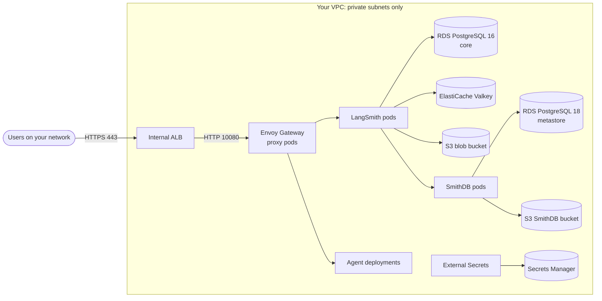

# Self-hosted LangSmith on Amazon EKS (AWS CDK)

This repository builds a private LangSmith installation in your AWS account:
- an [AWS CDK](https://docs.aws.amazon.com/cdk/v2/guide/home.html) app (TypeScript) creates all the AWS infrastructure;
- a few short scripts prepare the Kubernetes cluster;
- you install LangSmith with `helm`, from a command the scripts write for you.

**How to read this guide.**
- **Part 1** explains what gets built and why. Read it once, before you start.
- **Part 2** is the deployment, step by step.
- **Part 3** covers day-2 changes.
- **The Appendix** holds the reference tables for your network and security reviewers. Unfamiliar terms are in the glossary (Appendix H).

**Placeholders used throughout:**
- `<env>`: your config file's name (`config/<env>.ts`).
- `<name>`: the `name` setting in that file, which is the prefix of every resource.
- `<region>`, `<account>`: the AWS region and account from the same file.
- `<namespace>`: the Kubernetes namespace for LangSmith, `langsmith` by default.

---

## Part 1: Understand the solution

### 1.1 What you get



`cdk deploy` creates:

| Component | Details |
|---|---|
| **VPC** (optional, its own stack) | 3 private subnets, 3 small public subnets for the NAT, 3 pod subnets; or you use your VPC |
| **EKS 1.34** | private API endpoint, one managed node group, managed add-ons (VPC CNI, kube-proxy, CoreDNS, EBS CSI driver, metrics-server, Pod Identity agent when used) |
| **RDS PostgreSQL 16** ("core") and **18** ("metastore", for SmithDB) | IAM authentication and TLS: no database passwords |
| **ElastiCache Valkey** | IAM authentication and TLS |
| **S3** | one bucket for LangSmith blobs, one for SmithDB trace data |
| **Secrets Manager** | every application secret, under `<name>/` |
| **KMS key** | encrypts the Kubernetes secrets |
| **Route 53 private zone** | the LangSmith hostname |
| **Internal ALB** | HTTPS with your certificate, in front of Envoy Gateway |
| **IAM roles** | for EKS, the nodes and each workload: **IRSA** (default) or **EKS Pod Identity** |
| **Bastion** (optional) | reached through SSM only, no SSH, with the tools preinstalled |

LangSmith itself (chart `0.17.0`, with SmithDB, Fleet, Insights, Chat and Deployments) is installed with `helm` in Step 8.

**Every component is a switch.** Turn any of them off in your config and give the ID of the one you already have instead. That covers your VPC, EKS cluster, databases, buckets, DNS zone, KMS key, and IAM roles created by your IAM team. The full list is in Part 3, "Common changes".

### 1.2 How it is built

There are three layers, each run by you:

| # | Layer | Runs where | Does |
|---|---|---|---|
| 1 | `npx cdk deploy` | a laptop or CI runner with AWS credentials | creates every AWS resource. It only calls AWS APIs and never connects into the VPC. |
| 2 | `post-deploy/` scripts | mostly **inside the VPC** (the EKS API is private) | the work CloudFormation can't do: import a PEM certificate, write secret values, copy images into ECR, and set up Kubernetes (platform charts, Envoy Gateway, the secrets mapping, the database users) |
| 3 | `helm install` of LangSmith | inside the VPC | installs LangSmith from `out/helm-install-langsmith.sh`, which the scripts write. You review it, then run it. |

**Two CloudFormation stacks:**
- **`<name>-network`** is the VPC, only when CDK creates it. It lives longer than the cluster, so you can rebuild the other stack without touching it.
- **`<name>-langsmith`** is everything else.

**Why Kubernetes is set up by scripts, not by CDK.** CloudFormation can only call AWS APIs. CDK can install Helm charts, but only through a Lambda function with cluster-admin rights inside your VPC, with a 15-minute limit per chart and a rollback when a chart fails. A script is easier to read, re-run and debug.

**How this differs from a typical CDK app.** It keeps the standard layout (`bin/`, `lib/`, `test/`, `cdk.json`, one Construct per component), but is written to be reviewed:
- Most resources are L1 constructs (`Cfn*`), so the template holds only what the code says. High-level constructs such as `eks.Cluster` add Lambda functions.
- There are no Lambda functions or custom resources, which a test enforces.
- IAM is written by hand in `lib/iam/`, with no `grant*()` helpers.
- `cdk synth` runs offline, with no lookups.

### 1.3 Network

**Everything runs in private subnets.**
- **Users** reach LangSmith through an **internal** ALB. By default only the VPC's own ranges may connect, so list your users' ranges in `ingress.allowedCidrs`.
- **The EKS API endpoint** is private by default (`eks.publicAccessCidrs: []`).

**How pods get addresses.** There are two options. Use the default unless one of the reasons in the right-hand column applies to you.

| | **Separate pod range** (default, recommended) | **Pods in the private subnets** |
|---|---|---|
| Where pods get addresses | a second VPC range, `100.64.0.0/16`, that your network never routes | the routable private subnets, next to the nodes |
| Routable addresses it uses | few: only nodes, the ALB, the databases and the VPC endpoints (a /25 per AZ) | about 4× more (a /23 or /22 per AZ) |
| What networks outside the VPC see | the node's address | the pod's address |
| Choose it when | almost always | other networks must reach pods directly by IP, or you bring a VPC without pod subnets. This matches LangChain's Terraform module. |
| Config | nothing to set (`network.layout: 'B'` is the default) | `network.layout: 'A'`, or list no pod subnets when you bring your VPC |

**How the separate pod range works:**
- **The tags.** Pod subnets are tagged `kubernetes.io/role/cni=1` and the private subnets `kubernetes.io/role/cni=0`. The VPC CNI (the EKS pod-networking add-on) uses these tags to place pods. This needs VPC CNI v1.22.2 or later, so CDK pins v1.23.1.
- **Inside the VPC,** RDS, Valkey and endpoints see the **pod's own address** (100.64.x.x). The security groups allow every VPC range for this reason.
- **Outside the VPC** (peered VPCs, the Transit Gateway, on-premises, the internet), traffic carries the **node's address**. The VPC CNI translates it (SNAT), so the 100.64 range never needs a route outside the VPC.
- **One deploy.** Pods get pod-subnet addresses from the first boot.

**Choosing the pod range.** Agree it with your network team:
- **Where from:** `100.64.0.0/10` or `198.19.0.0/16`. AWS allows either as a second VPC range.
- **No overlap:** it must not overlap anything pods need to reach, such as carrier-grade NAT, Zscaler or Tailscale overlays, on-premises networks, or VPCs on the Transit Gateway. If `100.64.0.0/16` is taken, use another /16, such as `198.19.0.0/16`.
- **Never advertise it,** in Transit Gateway routes or BGP. Then every VPC can reuse it.
- **Set it** with `network.podCidr` for a new VPC (a /16; the default is `100.64.0.0/16`), or with `network.podSubnets` and `network.vpcCidrs` for your own VPC. Pin it: changing it replaces the pod subnets.

**Subnet sizes per AZ** (3 AZs recommended, at least 2):

| | Private (nodes, ALB, databases) | Pod subnet | Public (only for a NAT in the VPC) |
|---|---|---|---|
| Separate pod range (default) | /25 (minimum /26) | /19 in 100.64.0.0/16 (minimum /24 for prod with ~50 agents, /26 for dev) | /28 |
| Pods in the private subnets, dev and stage | /23 | none | /28 |
| Pods in the private subnets, prod | /22 | none | /28 |

**The request path:**

```txt
client → internal ALB :443 (TLS) → Envoy proxy pods :10080 → HTTPRoute → LangSmith
                                                           → HTTPRoute → each agent deployment
```

- **The ALB and its target group** are created by CDK.
- **Envoy Gateway** (a Kubernetes Gateway API implementation) is installed by `post-deploy/04`. LangSmith and each agent deployment get their own route, an `HTTPRoute`.
- **Without Envoy Gateway:** `ingress.mode: 'alb'` sends the ALB straight to the LangSmith pods. Every route must then live in the LangSmith namespace.

**DNS, TLS and outbound access:**
- **DNS.** CDK creates a private zone, such as `corp.example`, with a record for the hostname. Your corporate DNS must forward that zone to the VPC (Part 2, Step 9).
- **TLS** ends at the ALB, which uses your ACM certificate (policy `ELBSecurityPolicy-TLS13-1-2-2021-06`, no HTTP listener). From the ALB to Envoy and the pods, traffic is plain HTTP inside the VPC. RDS and Valkey always use TLS.
- **Outbound.** The cluster needs `beacon.langchain.com:443` (license check) and AWS APIs, through a NAT or VPC endpoints. Images come from your ECR, so nodes never pull from the internet. Appendix B lists every endpoint.

### 1.4 Identity and security

**Who deploys.**
- **The CDK toolkit.** CDK deploys through CloudFormation, using a "toolkit" stack that `cdk bootstrap` creates. By default its execution role has `AdministratorAccess`. This app instead gives it **three scoped policies** from `iam/`, limited to one environment's `name`.
- **One toolkit per environment,** selected by `cdkQualifier` in your config. Because of that scoping, a shared toolkit would let a second environment replace the first one's policies.

**Three identities** take part in Part 2:

| Identity | Steps | Needs |
|---|---|---|
| IAM admin | 2 | rights to create IAM policies and run `cdk bootstrap` (which creates roles) |
| Deployer: a person or CI | 4 (and Part 3) | `sts:AssumeRole` on `arn:<partition>:iam::<account>:role/cdk-<qualifier>-*`, nothing else |
| Script runner | 3, 5, 6–9 | the policy `<name>-operator-policy` (from `iam/operator-policy.json`) attached to their role, plus cluster-admin access to EKS: their role in `eks.adminRoleArns`, or the bastion's role, which gets both when `bastion.operatorPolicyArn` is set |

**How pods get AWS access.** Each workload has its own IAM role with short-lived credentials. There are no access keys anywhere.
- **IRSA** (the default) trusts the cluster's OIDC provider.
- **EKS Pod Identity** (`workloadIdentity: 'podIdentity'`) uses pod identity associations.

The permissions are the same either way. Nodes have no access to buckets, secrets or databases.

**How IRSA works.** Everything is created by the one `cdk deploy`, in this order:
1. **EKS gives every cluster an OIDC issuer:** a URL where it publishes the keys it signs ServiceAccount tokens with.
2. **CDK registers that issuer in IAM** as an OIDC provider, for the audience `sts.amazonaws.com`.
3. **Each workload role trusts one ServiceAccount.** Its trust policy says that a token from this provider, with `sub` = `system:serviceaccount:<namespace>:<serviceaccount>`, may assume the role (`sts:AssumeRoleWithWebIdentity`). The issuer's ID appears inside the condition keys, so `lib/iam/trust.ts` writes the policy as text, and CloudFormation fills in the ID with `Fn::Sub`.
4. **`post-deploy/04` annotates each ServiceAccount** with its role (`eks.amazonaws.com/role-arn`).

When a pod starts, EKS gives it a token. The AWS SDK exchanges the token with STS for short-lived credentials, and STS checks the signature and `sub` first.

Nothing needs updating by hand, unless your IAM team brings the roles: then they apply the final trust after the first deploy (Appendix C).

**Secrets.** They live only in Secrets Manager under `<name>/`. The External Secrets Operator (ESO) copies them into Kubernetes Secrets. No secret value is ever in a template, in this repository, in your config, in the Helm values or in `out/`.
- **Generated at deploy time:** the API-key salt, the JWT secret and the first admin password.
- **Written by `post-deploy/01`:** the license key (from your file) and the three add-on encryption keys.
- **Databases and cache:** pods connect with 15-minute IAM tokens, not passwords. The RDS master passwords are managed and rotated by RDS.

**Encryption, hardening and logs:**
- **Encryption at rest:**
  - the RDS, Valkey and EBS volumes are encrypted with AWS-managed keys;
  - S3 uses SSE-S3 with Block Public Access, and accepts HTTPS only;
  - Kubernetes Secrets use this app's KMS key.
- **Node hardening:** nodes require IMDSv2 with a hop limit of 1, so pods cannot use the node's role.
- **Logs on:** all five EKS control-plane log types go to CloudWatch, kept 90 days (`eks.logRetentionDays`).
- **Not set up by this app:** VPC flow logs, ALB access logs, Kubernetes NetworkPolicies.
- **Tags:** every resource that can carry them gets `app=langsmith` and `langsmith-env=<name>`, plus your `extraTags`.

Appendix C lists every role and everything it may do; Appendix D lists every secret.

### 1.5 Sizing

Two settings decide every size:
- **`size`** (`lab`, `small`, `medium` or `large`) is how **big**.
- **`environment`** (`dev`, `stage` or `prod`) is how **protected**.

Leave `size` out and it follows the environment: dev → small, stage → medium, prod → large. To change one value, use `sizes`, such as `sizes: { nodeMax: 8 }`.

| `size` | lab (tests only) | small | medium | large |
|---|---|---|---|---|
| Load, as a starting point | a few people | ≤ 5 readers, ~10 traces/s | ~10–20 readers, ~50 traces/s | ~20+ readers, ~100 traces/s |
| Nodes (min / desired / max) | m6i.4xlarge 2 / 2 / 4 | m6i.4xlarge 3 / 3 / 6 | m6i.8xlarge 3 / 3 / 8 | m6i.8xlarge 4 / 5 / 10 |
| RDS core / metastore | db.t3.medium / db.t3.medium | db.m6g.large / db.r6g.large | db.m6g.large / db.r6g.xlarge | db.m6g.xlarge / db.r6g.xlarge |
| RDS storage (start → max) | 20 → 100 GiB | 50 → 500 GiB | 100 → 1000 GiB | 100 → 2000 GiB |
| Valkey node | cache.t3.medium | cache.m7g.xlarge | cache.m7g.xlarge | cache.m7g.2xlarge |
| SmithDB tier | small, reduced | small | medium | medium |

| `environment` | dev | stage | prod |
|---|---|---|---|
| RDS Multi-AZ, deletion protection | off | on | on |
| RDS backups, Valkey snapshots | 7 days | 7 days | 14 days |
| Valkey nodes | 1 | 2 | 3 |
| NAT gateways (new VPC) | 1 | 1 per AZ | 1 per AZ |

**Cost, roughly per month** (On-Demand, us-east-1, without data transfer): dev + lab about $1,450, dev + small about $2,550, stage + medium about $5,100, prod + large about $8,500–9,000. EC2 is 60–70 % of it.

**Notes:**
- **`lab`** is the cheapest shape that runs every feature, for demos and tests. SmithDB runs at about a quarter of its `small` tier. It is not a LangChain-tested size, and it requires `environment: 'dev'`.
- **Nodes are m6i, not m5,** because each SmithDB cache volume needs 1,000 MiB/s of EBS bandwidth.
- **To see what your config resolves to,** and where each value comes from, run `npm run sizes -- -c config=<env>`.

### 1.6 Choose a starting config

Your settings are one TypeScript file, `config/<env>.ts`. Copy the example that fits, then edit it (Step 1).

| Your situation | Start from |
|---|---|
| A new, dedicated VPC; first install or evaluation | [`config/examples/irsa-dev.ts`](config/examples/irsa-dev.ts): new VPC, IRSA, bastion |
| The same, with EKS Pod Identity | [`config/examples/podidentity-dev.ts`](config/examples/podidentity-dev.ts) |
| Your organization provides the VPC | [`config/example.ts`](config/example.ts), or [`config/examples/byo-vpc.ts`](config/examples/byo-vpc.ts) with pod subnets and your DNS zone |
| Pods in the private subnets instead of a separate pod range | [`config/examples/layout-a.ts`](config/examples/layout-a.ts) |
| Your IAM team creates every role | [`config/examples/byo-iam.ts`](config/examples/byo-iam.ts) |
| No Envoy Gateway: the ALB straight to the pods | [`config/examples/alb-ingress.ts`](config/examples/alb-ingress.ts) |
| Your own EKS cluster | any of the above, with `eks.enabled: false`, `kms.enabled: false` and `ingress.mode: 'alb'` |

---

## Part 2: Deploy, step by step

> **Status:** the default path (separate pod range, Envoy Gateway, Steps 1–8) has been run on AWS, with Steps 7–8 run from a laptop rather than the bastion. Appendix F lists what hasn't been run yet. Run it first in a test account.

Plan for about half a day; the first `cdk deploy` alone takes 45–75 minutes. The identities are described in 1.4.

| Step | What | Where | Identity | Time |
|---|---|---|---|---|
| 1 | Write your config | any machine with Node.js 22 (no AWS access) | none | 30 min |
| 2 | Create the policies and the CDK toolkit | an IAM admin's machine | IAM admin | 10 min |
| 3 | Provide the TLS certificate | your machine | script runner | 10 min |
| 4 | Deploy | laptop or CI | deployer | 45–75 min |
| 5 | Seed secrets, copy images | your machine (needs internet) | script runner | 30–40 min |
| 6 | Move into the VPC | the bastion | script runner | 10 min |
| 7 | Prepare the cluster | the bastion | script runner | 15 min |
| 8 | Install LangSmith, smoke test | the bastion | script runner | 20 min |
| 9 | Make it reachable, sign in | your DNS and PKI teams, a browser | none | varies |

Every script after Step 4 reads its inputs from `out/cdk-outputs.json`. So one checkout of this repository serves one environment, unless you point `CDK_OUTPUTS` at another outputs file.

### Before you start

**What you bring:**
- [ ] **A LangSmith license key** as a file (a self-hosted license).
- [ ] **A hostname and a private domain**, such as `langsmith.corp.example` in zone `corp.example`.
- [ ] **A TLS certificate for the hostname:** an ISSUED certificate in ACM, or PEM files (certificate, key, chain). A private CA is fine.
- [ ] **The first admin's email.**
- [ ] **Cluster admins:** the ARN of each IAM role that may administer the cluster, including the role's path.
- [ ] **For your own VPC:** its ID and every range, the private subnets (one per AZ), and the pod subnets with their tags (1.3).
- [ ] **A SmithDB ticket** in the [LangChain Support Portal](https://support.langchain.com/). LangChain asks for one for every SmithDB installation, so it can review the setup. Open it before you install; it must be resolved before production, not before these steps.

**Tools.**
- **Where you run CDK (Steps 1, 2 and 4):** this repository, Node.js 22, AWS CLI v2, and `envsubst` for Step 2. The CDK itself is pinned in `package.json` and installed by `npm ci`; always run it as `npx cdk`.
- **Where you run the scripts:** AWS CLI v2, `kubectl` (within one minor version of 1.34), `helm` 3.12 or later (not Helm 4: the scripts stop on it), `jq`, `yq` (v4), `envsubst` and `openssl`.
- **Step 5 only:** `crane`.
- **To reach the bastion:** the Session Manager plugin for the AWS CLI.
- **On the bastion,** the tools are installed at boot. Each script names any tool that is missing.

**Account checks:**
- [ ] **Region:** at least 2 AZs that EKS supports. EKS rejects the AZ IDs `use1-az3`, `usw1-az2` and `cac1-az3`. Names map to different IDs in each account, so check with `aws ec2 describe-availability-zones --query 'AvailabilityZones[].[ZoneName,ZoneId]'`.
- [ ] **vCPU quota** ("Running On-Demand Standard instances"): lab 66, small 98, medium 258, large 322.
- [ ] **Elastic IPs:** 1 per NAT gateway. The default quota is 5.
- [ ] **Organization policies (SCPs)** allow CloudFormation and the services in 1.1. Add any mandatory tags as `extraTags`. If new roles need a permissions boundary, set `permissionsBoundaryArn`.

**Sign-offs.** Each team reviews one part:

| Team | Reviews |
|---|---|
| Network | 1.3, Appendix B: ranges, routing, ports, outbound access, DNS forwarding |
| Security / IAM | 1.4, Appendix C and D, and the policies in `iam/` |
| PKI | the certificate, and how clients trust its CA (Step 9) |
| Platform | where each step runs (the table above) and who is a cluster admin |

### Step 1: Write your config

**Where:** any machine with Node.js 22. No AWS access is needed.

**Run:**

```bash
npm ci
cp config/examples/irsa-dev.ts config/dev.ts      # or the example that fits (1.6)
$EDITOR config/dev.ts
npx cdk synth -c config=dev                        # checks the config, writes the templates (offline)
npm run sizes -- -c config=dev                     # what each size resolves to
```

**Set at least** `name`, `account`, `region`, `cdkQualifier`, `environment`, `network`, `dns`, `secrets.adminEmail`, `eks.adminRoleArns` and `ingress.allowedCidrs` (your users' ranges).

**Check:** `cdk synth` lists every mistake in plain English. Fix them until only the certificate error is left; Step 3 removes that one.

Keep `config/<env>.ts` in your own repository. It holds IDs and settings, never a secret.

### Step 2: Create the policies and the CDK toolkit

**Where:** an admin with IAM rights, once per environment.

**Run** (with your values; `NAME` and `QUALIFIER` are `name` and `cdkQualifier` from your config):

```bash
export ACCOUNT_ID=123456789012 AWS_REGION=us-east-1 NAME=langsmith-dev QUALIFIER=lsdev
export AWS_PARTITION="${AWS_PARTITION:-aws}"   # in GovCloud, export AWS_PARTITION=aws-us-gov first
mkdir -p out
for f in iam/cdk-execution-policy-*.json iam/operator-policy.json; do
  envsubst '${AWS_PARTITION} ${ACCOUNT_ID} ${AWS_REGION} ${NAME}' < "$f" > "out/$(basename "$f")"
  aws iam create-policy --policy-name "$NAME-$(basename "$f" .json)" --policy-document "file://out/$(basename "$f")" \
    --tags Key=app,Value=langsmith Key=langsmith-env,Value=$NAME
done

P=arn:$AWS_PARTITION:iam::$ACCOUNT_ID:policy/$NAME-cdk-execution-policy
CDK=$PWD/node_modules/.bin/cdk
(cd "$(mktemp -d)" && "$CDK" bootstrap "aws://$ACCOUNT_ID/$AWS_REGION" \
  --qualifier "$QUALIFIER" --toolkit-stack-name "CDKToolkit-$QUALIFIER" \
  --cloudformation-execution-policies "$P-1-network-compute,$P-2-data,$P-3-iam" \
  --tags app=langsmith --tags langsmith-env=$NAME)
```

The bootstrap runs from an empty folder on purpose. Inside the repository, `cdk` would first try to build the app, which needs `-c config=<env>` and a certificate (Step 3).

**Variations:**
- **Your IAM team creates every role:** leave `$P-3-iam` out of the bootstrap.
- **The bastion will run the scripts:** set `bastion.operatorPolicyArn` to `arn:<partition>:iam::<account>:policy/<name>-operator-policy`.
- **A permissions boundary on the toolkit's roles:** add `--custom-permissions-boundary <policy-name>`.

**Check:** the stack `CDKToolkit-<qualifier>` is `CREATE_COMPLETE`.

### Step 3: Provide the TLS certificate

**Where:** any machine with AWS credentials.

`cdk deploy` creates the ALB's HTTPS listener, so the certificate must exist first. (With `ingress.mode: 'alb'`, it can also come after the deploy: run `00` without arguments then.)

**Path A: the certificate is already in ACM** (requested from ACM or ACM Private CA, or imported by your PKI team). It must be:
- **ISSUED,** in the **same account and region** as this environment;
- **for the hostname:** `dns.hostname` is its name, a SAN, or covered by a one-level wildcard (`*.corp.example` covers `langsmith.corp.example`);
- **an RSA key of 2048, 3072 or 4096 bits, or an ECDSA key.**

Find and check it:

```bash
aws acm list-certificates --region <region> --query 'CertificateSummaryList[].[DomainName,Status,CertificateArn]' --output table
aws acm describe-certificate --region <region> --certificate-arn <arn> \
  --query 'Certificate.[Status,Type,KeyAlgorithm,NotAfter,SubjectAlternativeNames]'
```

Put the ARN in `dns.certificateArn`. You need no PEM files, no `settings.env` TLS paths and no `00`.

**Who renews it:**
- **ACM-issued certificates** (public, or from ACM Private CA) renew themselves.
- **Imported certificates** are your PKI team's job: re-import into the **same ARN** before they expire (Part 3, Rotation).

**Path B: you have PEM files** (certificate, private key without a passphrase, chain). Import them:

```bash
cp post-deploy/settings.env.example post-deploy/settings.env && $EDITOR post-deploy/settings.env   # the TLS_*_FILE paths
./post-deploy/00-import-certificate.sh --name <name> --region <region> --hostname <hostname>
```

Put the printed ARN in `dns.certificateArn`. Keep the PEM files in `./secrets/`, which git ignores, and delete them once the import is done.

**Check:** `npx cdk synth -c config=<env>` now passes. The config check confirms the ARN's account and region; the commands above confirm its status and name.

### Step 4: Deploy

**Where:** a laptop or CI runner with AWS credentials.

**Run:**

```bash
npx cdk diff   -c config=<env>
npx cdk deploy --all -c config=<env> --no-rollback      # 45–75 minutes
```

- **`--no-rollback` is for the first deploy only.** If it fails, fix the cause and run the same command again; it continues where it stopped. Without the flag, a failure would delete everything created so far.
- **Leave the flag off for every later deploy.**

**Check:** `out/cdk-outputs.json` exists. It holds every name, ARN and ID the scripts need, and no secrets. Optionally, `./tools/list-resources.sh <name>` lists everything the environment has in AWS.

### Step 5: Seed secrets and copy images

**Where:** the same machine. It needs internet access to the public image registries. Running this step here means the license file never has to reach the bastion.

Put the license key in `secrets/langsmith-license.txt`, or point `LICENSE_KEY_FILE` in `post-deploy/settings.env` at it.

**Run:**

```bash
./post-deploy/01-seed-secrets.sh     # the license key + the 3 encryption keys, into Secrets Manager
./post-deploy/03-mirror-images.sh    # copies every image into ECR repositories <name>/*
```

- `01` only fills secrets that still hold the placeholder `REPLACE_ME`, so re-running it is safe.
- `03` copies about 20 images, which takes 30–40 minutes. It skips images it has already copied, so if your login expires partway, log in again and re-run it.

**Check:** both scripts end without errors, and `03` reports every image as present in ECR.

### Step 6: Move into the VPC

**Where:** the bastion (`bastion.enabled: true`, as in `irsa-dev`), or any host that can reach the private EKS API, such as a CI runner in the VPC or a VPN-connected machine.

**Run,** from your machine:

```bash
BASTION=$(jq -r '.[].BastionInstanceId // empty' out/cdk-outputs.json)
aws ssm start-session --region <region> --target "$BASTION"      # needs the Session Manager plugin
```

Then, on the bastion:
1. **Get this repository** with `git clone` from wherever you keep your copy. The bastion has `git`, but needs read access to that repository.
2. **Copy `out/cdk-outputs.json`** from your machine into `out/`. It holds no secrets, so pasting it with `cat > out/cdk-outputs.json` works.
3. **AWS credentials:**
   - with `bastion.operatorPolicyArn` set, the instance's role has everything it needs;
   - otherwise, configure an SSO profile and run `aws sso login`. That role needs the script-runner policy and must be in `eks.adminRoleArns`.
4. **Copy `post-deploy/settings.env` only if you changed a default,** such as `CUSTOM_CA_BUNDLE_FILE`.

**Check:** `aws sts get-caller-identity` works.

### Step 7: Prepare the cluster

**Where:** the bastion.

**Run:**

```bash
./post-deploy/04-cluster-prereqs.sh all
```

It runs nine steps. Each is safe to re-run on its own, by number or by name (`./post-deploy/04-cluster-prereqs.sh 5`, or `... envoy-gateway`).

| # | Name | What it does |
|---|---|---|
| 1 | `kubeconfig` | writes `out/kubeconfig`; your `~/.kube/config` is left alone |
| 2 | `storage` | StorageClasses `gp3` (default) and `smithdb-cache`, and the LangSmith namespace |
| 3 | `pod-network` | separate pod range only, read-only: checks the subnet tags, the VPC CNI version and that every pod has a pod-subnet address |
| 4 | `platform` | Helm: AWS Load Balancer Controller, External Secrets Operator, Cluster Autoscaler, KEDA |
| 5 | `envoy-gateway` | Envoy Gateway, the LangSmith Gateway and its timeout policies, bound to CDK's ALB. It waits until the ALB reports the proxy pods healthy. |
| 6 | `custom-ca` | only with `CUSTOM_CA_BUNDLE_FILE`: the Secret `langsmith-custom-ca` |
| 7 | `secrets` | maps the Secrets Manager secrets into Kubernetes. It stops if Step 5 (`01`) has not run. |
| 8 | `db-bootstrap` | a one-shot Job that creates the IAM-login database users and the add-on databases |
| 9 | `values` | renders and validates the LangSmith values, and writes `out/helm-install-langsmith.sh` |

**Optional:** `./post-deploy/04-cluster-prereqs.sh render` writes every manifest and values file to `out/` without applying anything. Attach those files to a change request if you need one.

**Check:** the last line names `out/helm-install-langsmith.sh`. For your own `kubectl` commands from here on, run `export KUBECONFIG=$PWD/out/kubeconfig`.

### Step 8: Install LangSmith and run the smoke tests

**Where:** the bastion.

**Run:**

```bash
less out/helm-install-langsmith.sh          # review the exact helm command
bash out/helm-install-langsmith.sh          # 10–20 minutes; database migrations run first
./post-deploy/05-dns-and-smoke-test.sh
```

`05` checks:
- that LangSmith's route is accepted;
- that the hostname's DNS record points at the ALB (with `ingress.mode: 'alb'`, it writes the record);
- the health endpoints, from inside the cluster and through `https://<hostname>`.

**Check:** `05` ends with every test passed, and `kubectl -n <namespace> get pods` shows every pod Running.

### Step 9: Make it reachable and sign in

**Where:** your DNS and PKI teams, then a browser.

- **DNS.** Corporate DNS must resolve the private zone. Pick one:
  - (a) a Route 53 Resolver inbound endpoint (TCP and UDP 53 open from your DNS servers), plus a conditional forwarder on corporate DNS;
  - (b) associate the zone with a shared-services VPC that already has resolver endpoints;
  - (c) a CNAME to the ALB in corporate DNS.
- **Trust.** Users' machines must trust the CA that issued the certificate. With a public CA, there is nothing to do.
- **Users' network ranges** must be in `ingress.allowedCidrs` (Step 1).
- **To test before DNS is ready,** tunnel from your machine to the ALB through the bastion:

  ```bash
  aws ssm start-session --region <region> --target "$BASTION" --document-name AWS-StartPortForwardingSessionToRemoteHost \
    --parameters "host=<LoadBalancerDnsName>,portNumber=443,localPortNumber=8443"     # LoadBalancerDnsName: a stack output
  ```

  Add `127.0.0.1 <hostname>` to your machine's hosts file, then open `https://<hostname>:8443`.

**Sign in** at `https://<hostname>` with `secrets.adminEmail` and the generated password. Read the password with the script-runner credentials:

```bash
aws secretsmanager get-secret-value --region <region> --secret-id <name>/initial-org-admin-password --query SecretString --output text
```

**Check:**
1. The `standalone-*` pods (the Fleet, Insights and Chat services) log no database or Redis authentication errors.
2. A test agent deployment, created in the UI, becomes ready and answers a request that takes longer than 15 seconds.

---

## Part 3: Operate

**Every AWS change follows the same cycle:**

```bash
$EDITOR config/<env>.ts
npx cdk diff   -c config=<env>        # read it: "[-] replace" means a resource is recreated
npx cdk deploy --all -c config=<env>  # also rewrites out/cdk-outputs.json
```

**Before you deploy a change:**
- **Never accept a replacement** of a database, the cluster or the VPC without a plan.
- **Changes that replace:** `name`, the cluster's subnets, a database's major engine version, and the VPC's `layout` or `addressPlan`.
- **Turning a component off deletes it.** Buckets, secrets and the KMS key are kept by default (`dataRemovalPolicy: 'retain'`), and RDS keeps a final snapshot.
- **Deletion protection** (stage and prod): to delete a database or the ALB, first set `sizes: { deletionProtection: false }` and deploy.

### Common changes

| You want to | Change | Then |
|---|---|---|
| More nodes | `sizes: { nodeMax: 10 }` | `cdk deploy` |
| Another node type | `size`, or `sizes.nodeInstanceType` | `cdk deploy` without `--no-rollback`: a new node group comes up, then the old one is drained |
| A bigger database | `sizes.pgCoreClass` / `pgMetastoreClass` | `cdk deploy` (a short restart; storage can grow but never shrink) |
| Add a cluster admin | add the ARN to `eks.adminRoleArns` | `cdk deploy` |
| Make the EKS API private-only | `eks.publicAccessCidrs: []` | `cdk deploy` |
| Restrict who reaches the UI | `ingress.allowedCidrs: ['10.0.0.0/8']` | `cdk deploy` |
| Let LangSmith call Bedrock | `workloadRoles.bedrock: true` | `cdk deploy` |
| Switch IRSA ↔ Pod Identity | `workloadIdentity` | `cdk deploy`, then `04 platform envoy-gateway secrets values` and `bash out/helm-install-langsmith.sh`, then restart the pods that hold the old credentials: `kubectl -n external-secrets rollout restart deployment` and `kubectl -n <namespace> rollout restart deployment,statefulset` |
| Use your own RDS, bucket or cache | `postgres.core: { enabled: false, existing: {...} }` (and similar) | `cdk deploy`. **This deletes the one the stack created.** |
| Pin an add-on version | `eks.addonVersions: { coreDns: '...' }` | `cdk deploy` |
| A second environment in the account | a new `config/<env>.ts` with its own `name` and `cdkQualifier` | Step 2 for it, then deploy |
| LangSmith settings (replicas, SSO, ...) | `helm/langsmith-values.yaml`, or a file named by `EXTRA_VALUES_FILE` | `04 values`, then `bash out/helm-install-langsmith.sh` |
| A platform chart's settings | `helm/<chart>.yaml` | `./post-deploy/04-cluster-prereqs.sh platform` |
| Envoy Gateway or its policies | `helm/envoy-gateway.yaml`, `k8s/envoy-gateway-resources.yaml` | `./post-deploy/04-cluster-prereqs.sh envoy-gateway` |

For more load, the LangSmith replica counts go in `helm/langsmith-values.yaml`; each replica requests about 1 vCPU and 2 GiB. Raise `sizes.nodeMax` to match. Each deployed agent adds about 4 pods. See LangChain's [scaling guide](https://docs.langchain.com/langsmith/self-host-scale).

### Upgrades

**Chart and image versions are pinned in one place,** `post-deploy/lib.sh`, Envoy Gateway's included. EKS and add-on versions are set in your config. After you change one, run `03` (it copies only new images), then the `04` step that uses it.

- **LangSmith chart** (`LANGSMITH_CHART_VERSION`): run `03`, `04 values` and the install script. Compare the chart's per-agent Postgres and Redis templates with `operator.templates` in `helm/langsmith-values.yaml`. With Pod Identity, add any new ServiceAccount to `kubernetes.langsmithServiceAccounts` and run `cdk deploy`.
- **EKS:** raise `eks.version` by one minor version, then `cdk deploy`. Unpinned add-ons and the nodes follow. Then:
  - set `CLUSTER_AUTOSCALER_IMAGE_TAG` to the new minor version, and run `03` and `04 platform`;
  - check that the Envoy Gateway release supports the new Kubernetes version.
- **Envoy Gateway:** change `ENVOY_GATEWAY_CHART_VERSION` and `ENVOY_PROXY_IMAGE_TAG` together, then run `03` and `04 envoy-gateway`. v1.9 is supported until 2027-02-14.
- **Platform charts:** change the `*_CHART_VERSION`, then run `03` and `04 platform`. For the Load Balancer Controller, also compare its published IAM policy with `lib/iam/aws-load-balancer-controller-policy.json`.
- **The CDK itself:** bump `aws-cdk-lib` and `aws-cdk` together, then run `npm install`, `npm test`, and `cdk diff` for each environment. Expect no changes.

### Rotation

| What | How |
|---|---|
| License key | `aws secretsmanager put-secret-value --secret-id <name>/license-key --secret-string file://<new-file>`; then sync it now with `kubectl -n <namespace> annotate externalsecret langsmith-secrets force-sync=$(date +%s) --overwrite` (otherwise ESO syncs within an hour); then restart the LangSmith pods |
| Imported certificate | before it expires, re-import into the **same** ARN: `aws acm import-certificate --certificate-arn <arn> --certificate fileb://... --private-key fileb://... --certificate-chain fileb://...` |
| ACM-issued certificate, RDS master passwords | nothing to do: AWS renews or rotates them |
| `api-key-salt`, `jwt-secret`, the 3 encryption keys | **never**: stored data becomes unreadable and API keys stop working |

### Backups and restore

This app turns on what AWS offers; it does not automate a restore.
- **What is backed up:**
  - **RDS:** automated backups with point-in-time restore, for 7 days (dev, stage) or 14 days (prod).
  - **Valkey:** daily snapshots, kept for the same number of days.
  - **S3:** the buckets are **not** versioned. The SmithDB bucket holds the trace data, so add versioning or AWS Backup if you need to recover it.
  - **Secrets:** back up the salt, the JWT secret and the 3 encryption keys **together with the databases**. A restored database cannot read its data without them.
- **To restore into a new environment:**
  1. Restore the snapshots as new instances.
  2. Point a config at them (`postgres.*.existing`, `s3.*.existingBucketName`, `valkey.existing`).
  3. Copy the secret values into the new `<name>/` secrets before running `01`.

### Switching the ingress mode

**From `'alb'` to `'envoy-gateway'`.** LangSmith is unreachable from step 2 until step 4 ends.
1. Set `dns.certificateArn` and `ingress.mode: 'envoy-gateway'`.
2. Delete the DNS record that `05` wrote. CloudFormation fails on a record that already exists.
3. Run `cdk deploy`, then `04 envoy-gateway values`.
4. Run the install script, then `05`.

**Going back** is the same in reverse:
1. Deploy with `'alb'`.
2. Run `04 values` and the install script.
3. Run `05`, which writes the record.

### Teardown

**Where:** two ways, depending on where the EKS API can be reached from.
- **One machine** with Node.js (`npm ci` done, as in Step 4) that can also reach the EKS API:

  ```bash
  ./tools/teardown.sh <config>                   # asks you to type the environment name first
  ```

- **A private EKS API:** stage 1 on the bastion, then the rest on the deploy machine. Don't run stages 2–4 on the bastion: it has no Node.js, and `cdk destroy` deletes it.

  ```bash
  ./tools/teardown.sh --cluster-only             # on the bastion: reads out/cdk-outputs.json, no Node.js needed
  ./tools/teardown.sh <config> --skip-cluster    # then on the deploy machine
  ```

Afterwards, `./tools/list-resources.sh <name>` shows what is left (read-only).

`teardown.sh` works in four stages:
1. **In the cluster:** it uninstalls LangSmith and Envoy Gateway, and removes the load balancers and volumes that controllers created. It only touches the LangSmith and `envoy-gateway-system` namespaces.
2. **`cdk destroy`:** it destroys both stacks, in the right order. For stage and prod, turn deletion protection off first. Before that, it removes what would make the destroy fail:
   - with ingress mode `alb`, the DNS record `05` wrote into the private zone CDK created;
   - with `dataRemovalPolicy: 'destroy'`, the objects in the buckets CDK created.
3. **The check:** it runs `list-resources.sh`.
4. **What is kept on purpose:** it prints the delete commands, but never runs them:
   - what `retain` kept: buckets, secrets, the KMS key, final snapshots;
   - the ECR repositories;
   - the toolkit and its policies.

---

## Appendix: Reference

### A. Configuration and commands

**Where the settings are documented:**
- [`lib/config/types.ts`](lib/config/types.ts) documents every setting, and your editor shows it when you hover.
- [`config/example.ts`](config/example.ts) shows them all with short comments.
- The checks are in [`lib/config/validate.ts`](lib/config/validate.ts).

| Command | What it does |
|---|---|
| `npm test` | type check and unit tests, offline |
| `./tools/check-offline.sh` | every offline check CI runs: tests, a synth of each example, `shellcheck`, a render of the post-deploy files |
| `npx cdk synth -c config=<env>` | checks the config, writes the templates to `cdk.out/` |
| `npx cdk diff -c config=<env>` | what a deploy would change |
| `npm run sizes -- -c config=<env>` | every size and where it comes from |
| `npm run iam-pack -- -c config=<env> [--out-dir out/iam-pack]` | every IAM role as JSON, ready for an IAM team |
| `./tools/list-resources.sh <name>` | everything the environment has in AWS (read-only) |
| `./post-deploy/04-cluster-prereqs.sh render` | every Kubernetes file `04` would apply, written to `out/` |

**`cdk.json`.** It can't hold comments, so these are its settings that matter:
- `outputsFile` makes every deploy write `out/cdk-outputs.json`.
- `defaultCrossStackReferences: "weak"` passes the network stack's IDs without CloudFormation exports.
- `validateAgainstDefaultRules` turns CDK's template checks into errors.
- The other flags are CDK defaults. Leave them: changing a flag can change the templates.

### B. Network detail

**Security groups:**

| Group | Inbound | Attached to |
|---|---|---|
| `<name>-alb` | 443 from `ingress.allowedCidrs` (default: the VPC ranges) | the internal ALB |
| EKS cluster group (EKS creates it) | all from itself; 10080 from `<name>-alb` (Envoy) | nodes, pods, control plane |
| `<name>-eks-api` | 443 from the VPC ranges | the EKS API endpoint |
| `<name>-rds` | 5432 from the VPC ranges | both RDS instances |
| `<name>-cache` | 6379 from the VPC ranges | Valkey |
| `<name>-bastion` | none (outbound 443 only) | the bastion |

- **Egress:** `-rds`, `-cache` and `-alb` allow outbound only to the VPC ranges.
- **"All from itself"** on the cluster group covers node-to-node traffic and the control plane's calls to webhooks (LBC, ESO, KEDA, Envoy Gateway).

**Outbound access needed:**

| From | To |
|---|---|
| Cluster | `beacon.langchain.com:443` (license check); AWS APIs: STS, S3, Secrets Manager, ECR, EKS, EC2, ELB, Auto Scaling, and EKS Auth with Pod Identity |
| Deploy machine | `registry.npmjs.org`; AWS APIs |
| Script host | the chart repositories: `langchain-ai.github.io`, `aws.github.io`, `charts.external-secrets.io`, `kubernetes.github.io`, `kedacore.github.io`, `registry-1.docker.io` |
| Image copy (Step 5) | `registry-1.docker.io`, `auth.docker.io`, `production.cloudflare.docker.com`, `public.ecr.aws`, `registry.k8s.io`, `ghcr.io` |
| Bastion (at boot) | `dl.k8s.io`, `get.helm.sh`, `github.com`, `objects.githubusercontent.com`, the Amazon Linux repositories |
| Depends on your use | the LLM providers your users configure; whatever your agent deployments call; your SSO identity provider |

**A VPC without a NAT** (your own VPC only) needs:
- interface endpoints with private DNS for `ecr.api`, `ecr.dkr`, `sts`, `eks`, `ec2`, `autoscaling`, `elasticloadbalancing` and `secretsmanager`;
- `eks-auth` (with Pod Identity), `bedrock-runtime` (with Bedrock), and `ssm`, `ssmmessages` and `ec2messages` (for the bastion);
- an S3 gateway endpoint;
- a proxy path to `beacon.langchain.com`, and for the script host to the chart repositories above.

**IP use.**
- **Pods:** each takes one address, and each node holds about max(20, its pods + 5).
- **Platform:** the EKS control plane needs at least 6 free addresses per subnet, and the ALB a /27 with 8 free.
- **Pod count:** LangSmith runs about 50 pods before any agent deployment. Plan for about 70 in dev, 100 in stage, and 150 plus 4 per agent in prod.

**The network stack's address plan** (when `network.createVpc: true`):

| Pod addresses | VPC | Private ×3 | Public ×3 | Pods ×3 |
|---|---|---|---|---|
| Separate pod range (default, `layout: 'B'`) | 10.0.0.0/23 + `network.podCidr` (100.64.0.0/16) | /25 | /28 | /19 |
| Pods in the private subnets (`layout: 'A'`), `addressPlan: 'standard'` | 10.0.0.0/21 | /23 | /28 | none |
| Pods in the private subnets (`layout: 'A'`), `addressPlan: 'large'` | 10.0.0.0/20 | /22 | /28 | none |

**Notes:**
- **Pin `layout`, and `podCidr` (separate pod range) or `addressPlan` (pods in the private subnets), in your config.** Changing them replaces the VPC or its subnets.
- **To change the pod range,** set `network.podCidr`, such as `198.19.0.0/16`. To change the other ranges, edit `layoutCidrs` in `lib/stacks/network-stack.ts`.
- **On your own VPC with a separate pod range,** tag each pod subnet `kubernetes.io/role/cni=1` and each private subnet `kubernetes.io/role/cni=0`. The `=0` tag affects every cluster in that VPC.

### C. IAM roles and permissions

This section lists every IAM role the app creates, who can assume it, and everything it may do. It comes from `lib/iam/`: `roles.ts` (the roles), `trust.ts` (who assumes them) and `policies.ts` (what they allow). `npm run iam-pack -- -c config=<env>` prints the exact JSON for your config, and a test fails if this section and the code disagree.

**The roles** (all named `<name>-*`):

| Role | Assumed by | AWS managed policies | Its own permissions | Created when |
|---|---|---|---|---|
| `eks-cluster` | EKS (`eks.amazonaws.com`) | `AmazonEKSClusterPolicy` | the KMS key for Kubernetes secrets | `eks.enabled` |
| `eks-node` | the nodes (`ec2.amazonaws.com`) | `AmazonEKSWorkerNodePolicy`, `AmazonEC2ContainerRegistryPullOnly`, `AmazonSSMManagedInstanceCore` | none | `eks.nodeGroup.enabled` |
| `bastion` | the bastion (`ec2.amazonaws.com`) | `AmazonSSMManagedInstanceCore`, plus `bastion.operatorPolicyArn` if set | describe this cluster | `bastion.enabled` |
| `vpc-cni` | `kube-system/aws-node` | `AmazonEKS_CNI_Policy` | none | `eks.addons.vpcCni` |
| `ebs-csi` | `kube-system/ebs-csi-controller-sa` | `AmazonEBSCSIDriverPolicy` | none | `eks.addons.ebsCsiDriver` |
| `langsmith` | every ServiceAccount in the LangSmith namespace | none | the blob bucket, the core database users, the cache users; Bedrock if `workloadRoles.bedrock` | `workloadRoles.langsmith` |
| `smithdb` | `<namespace>/langsmith-smithdb` | none | the SmithDB bucket, the metastore user | `workloadRoles.smithdb` |
| `eso` | `external-secrets/external-secrets` | none | read the `<name>/` secrets and the RDS master secrets | `workloadRoles.externalSecrets` |
| `lbc` | `kube-system/aws-load-balancer-controller` | `<name>-lbc`: the controller's published policy (v3.5.0), created as a customer-managed policy because it is too long to be inline | none | `workloadRoles.loadBalancerController` |
| `cluster-autoscaler` | `kube-system/cluster-autoscaler` | none | resize only this cluster's node groups | `workloadRoles.clusterAutoscaler` |

**Who can assume each role.**
- **AWS services:** `eks-cluster` trusts `eks.amazonaws.com` (`sts:AssumeRole`, `sts:TagSession`). `eks-node` and `bastion` trust `ec2.amazonaws.com`.
- **Pods, with IRSA** (the default): each role trusts one ServiceAccount, through the cluster's OIDC provider. `<OIDC_ISSUER_HOST>` is `oidc.eks.<region>.amazonaws.com/id/<ID>`.

  ```json
  {
    "Version": "2012-10-17",
    "Statement": [{
      "Effect": "Allow",
      "Principal": { "Federated": "<OIDC_PROVIDER_ARN>" },
      "Action": "sts:AssumeRoleWithWebIdentity",
      "Condition": {
        "StringEquals": {
          "<OIDC_ISSUER_HOST>:aud": "sts.amazonaws.com",
          "<OIDC_ISSUER_HOST>:sub": "system:serviceaccount:<namespace>:<serviceaccount>"
        }
      }
    }]
  }
  ```

  The one exception is `langsmith`. Most LangSmith components share it, so it trusts the whole namespace: its `sub` condition is `StringLike` `system:serviceaccount:<namespace>:*`. Any pod in that namespace can use the role, so keep the namespace for LangSmith only.
- **Pods, with EKS Pod Identity:** every pod role trusts `pods.eks.amazonaws.com` (`sts:AssumeRole`, `sts:TagSession`) with no condition. The binding is a pod identity association per ServiceAccount. For `langsmith`, there is one association for each name in `kubernetes.langsmithServiceAccounts`.

**Every permission.** The roles' own permissions, statement by statement (the AWS managed policies are AWS's documents):

| Role | Statement | Actions | On |
|---|---|---|---|
| `eks-cluster` | `EnvelopeEncryptionOfSecrets` | `kms:Encrypt`, `kms:Decrypt`, `kms:ListGrants`, `kms:DescribeKey`, `kms:CreateGrant` | this app's KMS key |
| `bastion` | `WriteKubeconfig` | `eks:DescribeCluster` | this cluster |
| `langsmith` | `BlobBucket` | `s3:ListBucket`, `s3:GetBucketLocation`, `s3:ListBucketMultipartUploads` | the blob bucket `<name>-blob-<account>` |
| `langsmith` | `BlobObjects` | `s3:GetObject`, `s3:PutObject`, `s3:DeleteObject`, `s3:AbortMultipartUpload`, `s3:ListMultipartUploadParts` | the objects in that bucket |
| `langsmith` | `PostgresIamAuth` | `rds-db:connect` | the core database's users `langsmith_app`, `langsmith_fleet`, `langsmith_insights`, `langsmith_polly` |
| `langsmith` | `ValkeyIamAuth` | `elasticache:Connect` | the cache and its users `<name>-core`, `<name>-fleet`, `<name>-insights`, `<name>-polly` |
| `langsmith`, if `workloadRoles.bedrock` | `InvokeModels` | `bedrock:InvokeModel`, `bedrock:InvokeModelWithResponseStream` | foundation models and this account's inference profiles, in this region |
| `langsmith`, if `workloadRoles.bedrock` | `ListModels` | `bedrock:ListFoundationModels` | `*` (AWS does not scope this action) |
| `smithdb` | `SmithdbBucket` | `s3:ListBucket`, `s3:GetBucketLocation`, `s3:ListBucketMultipartUploads` | the SmithDB bucket `<name>-smithdb-<account>` |
| `smithdb` | `SmithdbObjects` | `s3:GetObject`, `s3:PutObject`, `s3:DeleteObject`, `s3:AbortMultipartUpload`, `s3:ListMultipartUploadParts` | the objects in that bucket |
| `smithdb` | `MetastoreIamAuth` | `rds-db:connect` | the metastore's user `smithdb_app` |
| `eso` | `ReadLangSmithSecrets` | `secretsmanager:GetSecretValue`, `secretsmanager:DescribeSecret` | the secrets under `<name>/`, and the two RDS master secrets (`rds!db-*`) |
| `cluster-autoscaler` | `Describe` | `autoscaling:DescribeAutoScalingGroups`, `autoscaling:DescribeAutoScalingInstances`, `autoscaling:DescribeLaunchConfigurations`, `autoscaling:DescribeScalingActivities`, `autoscaling:DescribeTags`, `ec2:DescribeImages`, `ec2:DescribeInstanceTypes`, `ec2:DescribeLaunchTemplateVersions`, `ec2:GetInstanceTypesFromInstanceRequirements`, `eks:DescribeNodegroup` | `*` (read-only) |
| `cluster-autoscaler` | `ScaleOwnClusterOnly` | `autoscaling:SetDesiredCapacity`, `autoscaling:TerminateInstanceInAutoScalingGroup` | only Auto Scaling groups tagged `k8s.io/cluster-autoscaler/<name>=owned` |

**Good to know:**
- **Nodes reach no buckets, secrets or databases.** Pods get those through their own roles. Nodes require IMDSv2 with a hop limit of 1, so pods cannot borrow the node role.
- **The node role's ECR access is not limited to your mirror.** `AmazonEC2ContainerRegistryPullOnly` also lets nodes pull the images of the VPC CNI, kube-proxy, CoreDNS and the EBS CSI driver, which live in AWS-owned registries. If you narrow it to your mirror, new nodes cannot start those add-ons.
- **The VPC CNI never uses the node role.** The cluster is created without EKS's default add-ons (`bootstrapSelfManagedAddons: false`). The `vpc-cni` and `kube-proxy` add-ons, with their roles, are installed before the node group, and CoreDNS and the EBS CSI driver after it.
- **SmithDB's ServiceAccount name comes from the Helm release name.** The install uses the release `langsmith`, which gives `langsmith-smithdb`. With another release name, the chart renders another name and the `smithdb` trust no longer matches. SmithDB still starts, but cannot read or write its bucket.
- **EBS encryption with your own KMS key:** if your account encrypts new EBS volumes with a customer-managed key by default, add that key's permissions to `ebs-csi` (the EBS CSI driver documentation has the statement). Otherwise the SmithDB volumes cannot be created. The app's own volumes use AWS-managed keys.
- **The cluster admins** are only `eks.adminRoleArns` and the bastion role, each with the EKS access policy `AmazonEKSClusterAdminPolicy`. CloudFormation's role is not one.
- **To check a pod's role:** `kubectl -n <namespace> describe pod <pod> | grep AWS_ROLE_ARN`. `aws iam simulate-principal-policy` checks only the role's own policies: it ignores the bucket policies, SCPs and KMS key policies.

**The policies you create** (Step 2). Each is scoped to resources named after this environment's `name`:

| File | Allows | Attached to |
|---|---|---|
| `iam/cdk-execution-policy-1-network-compute.json` | VPC, security groups, EKS, the ALB, the bastion. EC2 deletes only on resources tagged `langsmith-env=<name>`. | CloudFormation (the toolkit) |
| `iam/cdk-execution-policy-2-data.json` | KMS, S3, Secrets Manager, RDS, ElastiCache, the private zone | CloudFormation (the toolkit) |
| `iam/cdk-execution-policy-3-iam.json` | the roles and policies named `<name>-*`; the OIDC provider, created only with the tag `langsmith-env=<name>` and deleted or changed only when it carries it. Omit it when you bring every role. | CloudFormation (the toolkit) |
| `iam/operator-policy.json` | read the outputs; write only the 4 seeded secrets, and read the admin login; push to ECR; import the certificate, or re-import it, only when it is tagged `langsmith-env=<name>`; check the ALB, the DNS record and the subnet tags | whoever runs `post-deploy/` |

**Narrowing the DNS statement after the deploy.** The operator policy may change records in any hosted zone, because the private zone only exists once the deploy has created it. To limit it to this environment's zone:

```bash
ZONE=$(jq -r '.[].PrivateZoneId // empty' out/cdk-outputs.json)
jq --arg z "arn:${AWS_PARTITION:-aws}:route53:::hostedzone/$ZONE" \
  '(.Statement[] | select(.Sid == "DnsRecordForTheAlb") | .Resource) |= map(if test("hostedzone/") then $z else . end)' \
  out/operator-policy.json > out/operator-policy-narrowed.json
aws iam create-policy-version --set-as-default --policy-arn arn:<partition>:iam::<account>:policy/<name>-operator-policy \
  --policy-document file://out/operator-policy-narrowed.json
```

With a zone you bring (`dns.privateZone.existingZoneId`), you can narrow it before the deploy in the same way.

**To bring your own roles,** name them in `existingRoles` and the stack creates nothing for them. Create them from `npm run iam-pack` output, which has the same trust and permissions as above.
- **With Pod Identity,** this works in one pass.
- **IRSA trust names the cluster,** so with IRSA set `irsaTrustManagedExternally: true` and update the trust after the first deploy; `iam-pack --issuer` prints it. A rebuilt cluster has a new issuer, so update the trust again.
- **Database ARNs:** until the databases exist, the pack writes `dbuser:*/<user>`. Narrow it to the instance's resource ID afterwards; the pack's notes give the command.

### D. Secrets

| Secret (`<name>/...`) | Created by | Note |
|---|---|---|
| `license-key` | `01`, from your file | rotate it with `put-secret-value` |
| `fernet/agent-builder`, `fernet/insights`, `fernet/polly` | `01` (random) | the Fleet, Insights and Chat encryption keys: **never change** |
| `api-key-salt` | deploy (generated) | **never change** |
| `jwt-secret` | deploy (generated) | changing it signs everyone out |
| `initial-org-admin-password` | deploy (generated) | first sign-in |
| `initial-org-admin-email` | deploy, from your config | not a secret |
| `connections` | deploy | host names and IAM user names, no passwords |
| the two `rds!db-...` master secrets | RDS | read only by the database bootstrap Job |

### E. Troubleshooting

| Symptom | Fix |
|---|---|
| "no instances of the requested class available" | the database class isn't offered in that AZ; check with `aws rds describe-orderable-db-instance-options`, or choose another class |
| The first deploy failed | fix the cause and rerun the same command with `--no-rollback`; it continues |
| `UPDATE_ROLLBACK_FAILED` | wait until the database or cache is `available`, then run `aws cloudformation continue-update-rollback --stack-name <name>-langsmith` |
| `AccessDenied` from CloudFormation | CloudTrail (`errorCode = AccessDenied`, user `AWSCloudFormation`) names the call; add it to the right file in `iam/` and create a new policy version |
| `CDK output 'X' is missing` | the component is off, or `out/cdk-outputs.json` is older than the last deploy |
| `04` step 3 reports subnet tags or pod addresses | fix the tags it names, then replace the nodes once (scale the node group to 0 and back) |
| `04` step 7 stops on `REPLACE_ME` | run `01-seed-secrets.sh`, then `04 secrets` |
| `04` step 5 gives up waiting for healthy targets | `kubectl -n envoy-gateway-system describe targetgroupbinding langsmith-envoy` and `aws elbv2 describe-target-health` |
| `03` fails with `TOOMANYREQUESTS` | Docker Hub rate limit: `crane auth login index.docker.io -u <user>`, then rerun |
| `504` after about 15 seconds | Envoy's default timeout; check the policies with `kubectl -n <namespace> get backendtrafficpolicy,clienttrafficpolicy` |
| HTTPS errors after setting `CUSTOM_CA_BUNDLE_FILE` | the bundle replaces the pods' whole trust store: include the public roots **and** your CA |
| A SmithDB pod stays Pending | no node has room for its largest pod, or its volume failed; check `kubectl get pvc` and the EBS CSI logs |
| Reinstalling with the same `name` fails on secrets | retained or recently deleted secrets keep their names; delete them (test environments only) or use another `name` |

### F. What has been run on AWS

Every change is checked offline: the tests, a synth and `cfn-lint` of every example, `shellcheck`, `helm template` of the rendered values, and the Envoy manifests against their CRDs.

| Area | Status |
|---|---|
| Both stacks with only the scoped policies: deploy (IRSA, a new VPC with a separate pod range, `size: 'lab'`, the bastion) | **Run**: about 21 minutes |
| Separate pod range: pods in 100.64.0.0/16 through the subnet tags, VPC CNI v1.23.1, pod interfaces on the cluster security group | **Run** |
| EKS 1.34, the node group and add-ons, IRSA roles, RDS 16 and 18, Valkey, EBS volumes, secrets, private zone | **Run** |
| `00`–`05` and the LangSmith 0.17 install, run from a laptop through the allow-listed EKS endpoint, with Envoy Gateway ingress (ALB targets healthy, `https://<hostname>` → 200) | **Run** |
| Teardown (including `--cluster-only` and `--skip-cluster`), and the tag conditions in the policies (EC2 and KMS deletes, the OIDC provider, certificate imports); an earlier version ran teardown with pods in the private subnets | **Not yet run** on this version |
| `04` from the bastion; `CUSTOM_CA_BUNDLE_FILE`; agent deployments | **Not yet run** |
| `ingress.mode: 'alb'`, Pod Identity, bring-your-own VPC and roles | **Not yet run** |

**For a path not yet run:**
1. Deploy it first in a test account, with a fresh `name`, `dataRemovalPolicy: 'destroy'` and `--no-rollback`.
2. Run the scripts one step at a time.

### G. Repository map

| Path | Contents |
|---|---|
| `bin/` | the CDK app (`langsmith.ts`), and the `sizes` and `iam-pack` commands |
| `config/` | `example.ts`, `examples/`, and your `config/<env>.ts`. `local/` is git-ignored. |
| `lib/config/` | every setting (`types.ts`), the size presets (`sizing.ts`), the checks (`validate.ts`) |
| `lib/stacks/` | `network-stack.ts` (the optional VPC), `langsmith-stack.ts` (everything else, in numbered blocks) |
| `lib/components/` | one file per component, numbered like the stack's blocks |
| `lib/iam/` | all IAM that CDK creates: roles, policies, trust |
| `iam/` | the policies you create in Step 2 |
| `post-deploy/` | the scripts `00`, `01`, `03`, `04` and `05` (there is no `02`). `lib.sh` holds the shared functions and every pinned version; `settings.env.example` holds the file paths and optional overrides. |
| `helm/` | Helm values templates. Edit `langsmith-values.yaml` to configure LangSmith. |
| `k8s/` | Kubernetes manifest templates, and the database bootstrap SQL (static, for your DBA to review) |
| `tools/` | `teardown.sh`, `list-resources.sh`, `check-offline.sh`, the bastion's tool installer |
| `test/` | the unit tests (offline). `fixtures/` holds made-up outputs for render checks. |
| `out/` | generated and git-ignored: `cdk-outputs.json`, `kubeconfig`, the rendered files, `helm-install-langsmith.sh` |
| `secrets/` | git-ignored: your license and PEM files, while you need them |

### H. Glossary

| Term | Meaning |
|---|---|
| **CDK toolkit, qualifier** | the stack `CDKToolkit-<qualifier>` that `cdk bootstrap` creates and every deploy runs through; `cdkQualifier` selects it |
| **IRSA** | IAM Roles for Service Accounts: an IAM role trusts a pod's ServiceAccount through the cluster's OIDC provider |
| **EKS Pod Identity** | the newer alternative to IRSA: EKS maps a namespace and ServiceAccount to a role |
| **VPC CNI** | the EKS add-on that gives pods VPC addresses |
| **Separate pod range / pods in the private subnets** | where pods get addresses (Network, 1.3). The default, `network.layout: 'B'`, gives pods a non-routable second range; `'A'` puts them in the routable private subnets. |
| **ESO** | External Secrets Operator: copies Secrets Manager secrets into Kubernetes |
| **LBC** | AWS Load Balancer Controller: puts the Envoy pods behind the ALB, or creates the ALB with `ingress.mode: 'alb'` |
| **TargetGroupBinding** | the LBC object that keeps an ALB target group equal to a Service's pods |
| **Envoy Gateway** | a Kubernetes Gateway API implementation; it routes the ALB's traffic to LangSmith and each agent |
| **SmithDB** | LangSmith's trace store: pods in the cluster, data in S3, a catalog in the PostgreSQL 18 metastore |
| **Fleet, Insights, Chat** | LangSmith add-ons, each with its own database, Redis database and encryption key. Fleet is `agent-builder` in some names, and Chat is `polly`. |
| **Deployments (operator)** | runs agents inside the cluster and creates each one's pods and route |
| **HTTPRoute** | a Gateway API routing rule: which hostname and path go to which Kubernetes Service |
| **KEDA** | scales LangSmith workers on queue length |
| **Cluster Autoscaler** | adds or removes nodes, between `nodeMin` and `nodeMax`, as pods need room |
| **Encryption keys (Fernet)** | symmetric keys that Fleet, Insights and Chat use to encrypt the credentials they store |
| **`standalone-*` pods** | the Fleet, Insights and Chat services |
| **`addressPlan`** | pods in the private subnets (`layout: 'A'`) only: the size of the new VPC's address plan (`standard` /21 or `large` /20) |
| **Script runner** | whoever runs `post-deploy/`, with the policy from `iam/operator-policy.json` (not the Deployments operator) |

---

## Support

This repository is a reference implementation, provided as-is. LangSmith itself is supported through the [LangChain Support Portal](https://support.langchain.com/).
